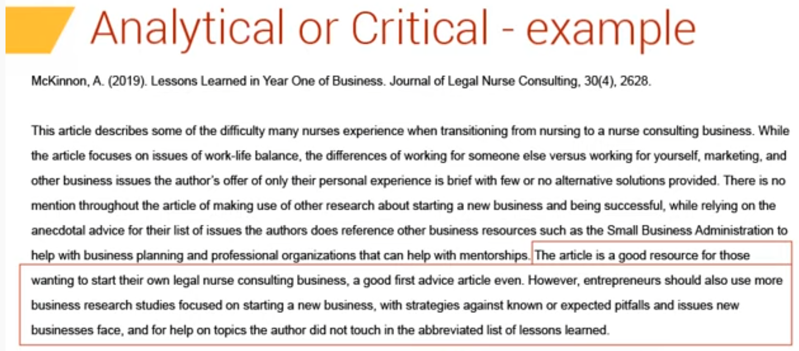
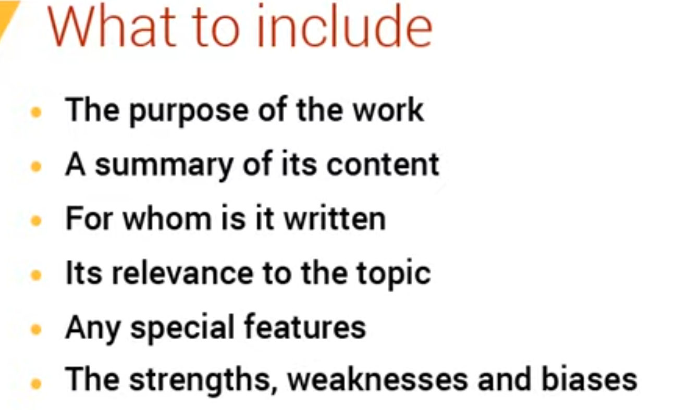

citation

APA book

- et el for more authors
- no name number? include paragraph number or others
- annotated bibliography?
  - add annotation for each source.
  - read about annotated bibliographies
  - 

**Paving the way: Transformation of healthcare delivery**

***\*Speaker(s): Max Peterson, Vice President, Worldwide Public Sector, AWS; Dr. Shafiq Rab, EVP, Chief Digital Officer, and CIO, Wellforce\****

How to write annotated bibliography

- Review
- Thesis formulation
- demostration of research
- Desctriptive or informative
  - Summarizes
  - mark the summary sentanse
- Analytical/Critical
  - 
  - 

- see https://guides.library.cornell.edu/annotatedbibliography for more example

## peer review article

has a discussion session

## verb choice

Use note/mention

Use state that

Use verb followed by that?
