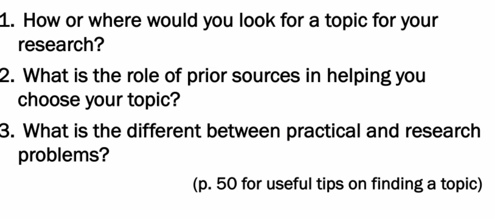
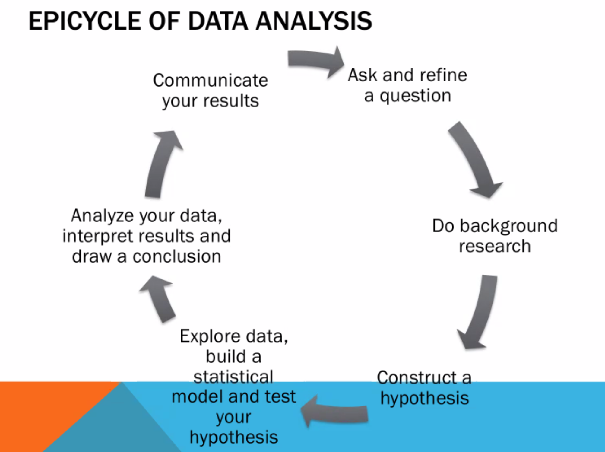

1: We can use the gwu libraray database and google scholar to search for our ideas for the existing researchs.  and finding the niche between existing research and our own idea/ or develop our idea better to fill the niche.

Activity events.

Got into Specific situation

2: what is already done and what is not yet done. Check on database.

3: practical problem for how to do, research problem for is to do?

The Data analysis circle is quiet general for most cases.

Choosing question 

- Too Broad
- narrower
- too bland
  - No depth
  - just google it
- challenging
- too speculative
  - too depending culture or background
  - too subjective
- grounded

Revisit task six.

discuss method section in 7 moves.

