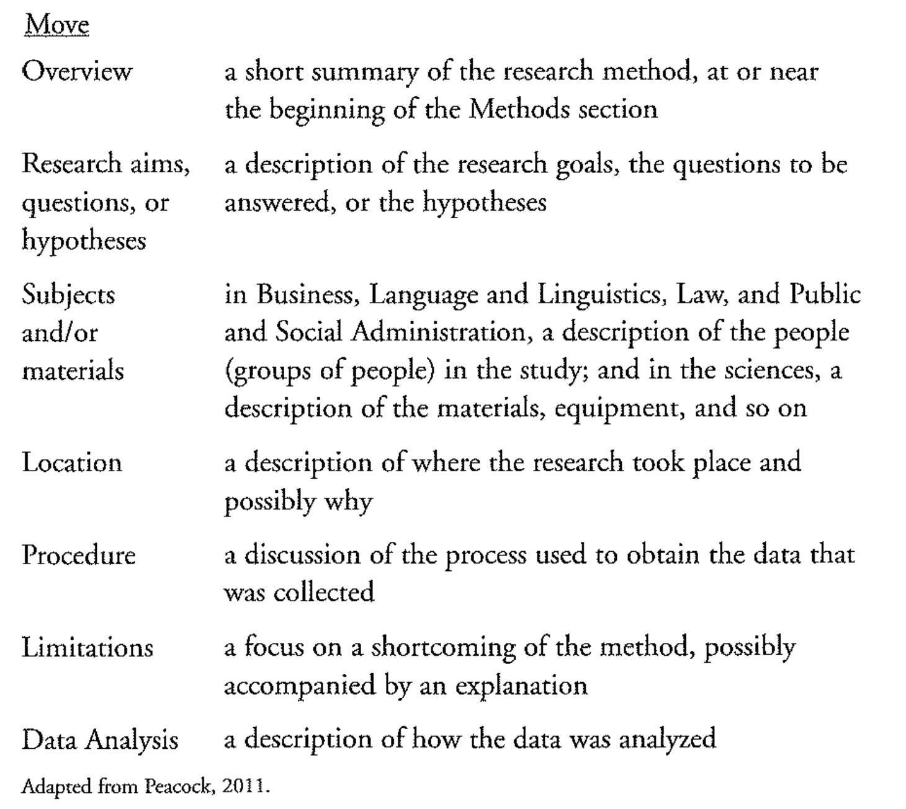
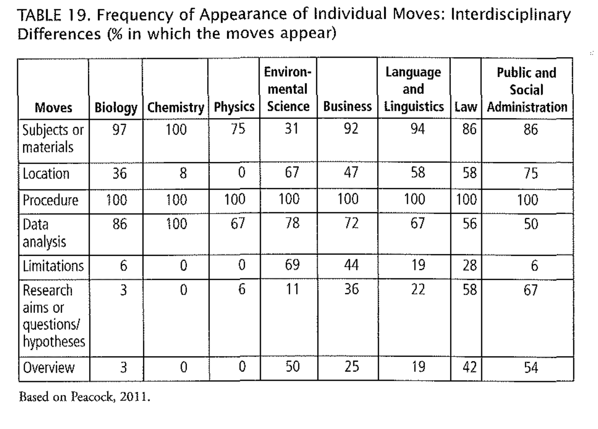

# method moves

1-6 : locations and subjects

7-9:Method Overview

10-23: Detailed procedures

sufficient

but not all covered

 How is the information organized? What subheadings could  you add to help readers? Where would you place them? 

How do the authors maintain a good flow of ideas in the first  paragraph? Do they follow this same strategy in the final paragraph? 

# Article report sheet:

after 2000

10 article

APA  cite

list the headings

provide the question.

# Homework

Choose two IMRD articles to compare the method section. Use pick up model.(7moves)

Tense used? past/ active/ passive

Extended vs Condensed. Example

# Useful expressions

Change over time both quantitively and qualitatively

As an aid to

For comparison to

