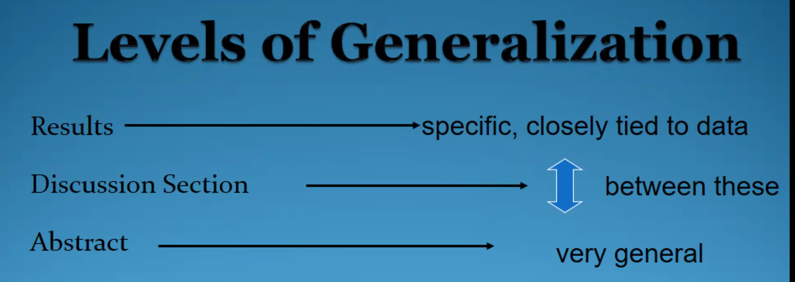
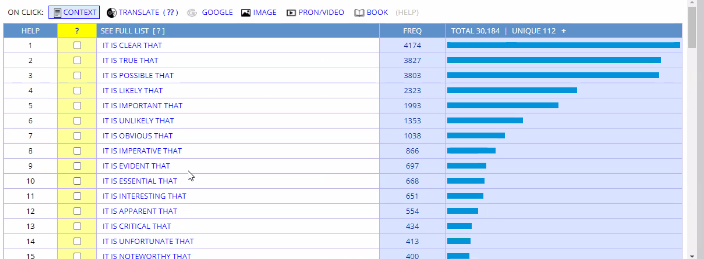

# Discussion

- Move 1 background info
- move2 summarizing and reporting key results
- Move3 comment on the key results.
- Move4 Limitation
- Move5 Making recommendations for future implementation and for future research

# Corpus

Use for determine the word if is academic or not.

- is evidenced by
- the genre of words
  - like "occur" only linked with neutral or negative words. -> death occur, accident occur
- 

